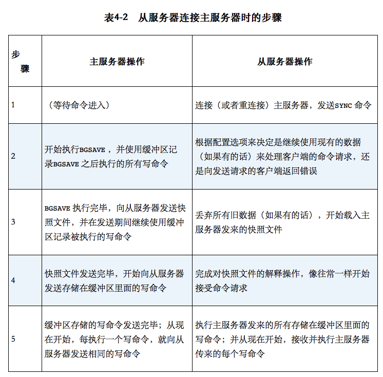
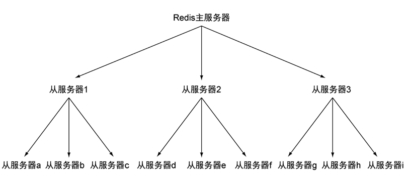
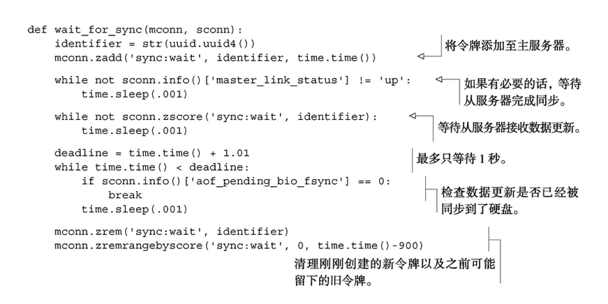
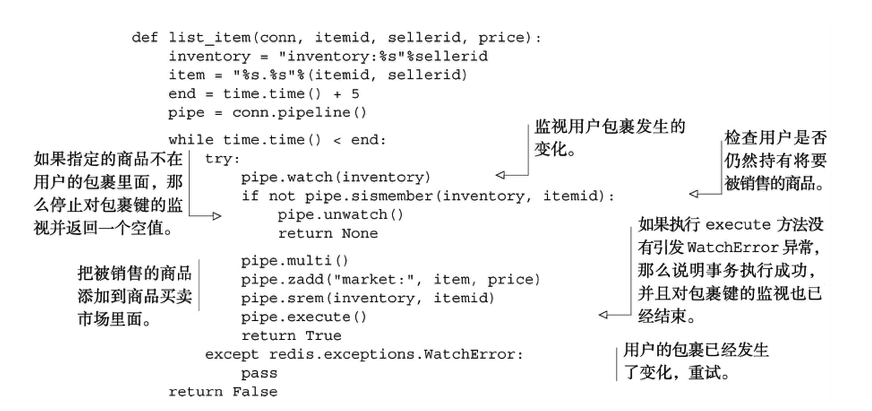

# redis

redis 支持5种数据结构

- 字符串 string
- 列表 list
- 哈希 hash
- 集合 set
- 有序集合 sorted set

### 字符串

值不能大于 512 MB

```shell
set mykey somevalue
get mykey
set mykey val nx  # 如果 key 存在则报错
set mykey val xx  # 如果 key 不存在则报错
getset mykey newval # 设置新值, 返回旧值

set counter 100  # 注意只有数字才能加
incr counter  # 加1
decr counter  # 减1
incrby counter 50  # 加50

mset a 10 b 20 c 30 # 批量设置
mget a b c   # 批量获取
```

### 通用命令

```shell
exists mykey  # 判断 key 是否存在
del mykey  # 删除 key
type mykey  # 查看类型
expire mykey 5  # 设置过期时间 5 秒
keys my*   # 查询所有以 my 为前缀的 key
```

### 列表

redis 的 list 是 linked list

```shell
rpush mylist A B C  # 插入数据
rpush mylist B  # 在尾部添加数据
lpush mylist D  # 在头部添加数据
rpop mylist  # 从尾部取出数据
lpop mylist  # 从头部取出数据
llen mylist  # 返回 list 的长度

lrange mylist 0 -1  # 范围查看数据, 注意因为是 linked list, 所以从头尾获取小范围数据性能很好
ltrim mylist 0 3  # 移除指定范围外的数据, 和 lrange 配合使用可以保证生成并获取定长数组, 例如 top10

brpop mylist 5  # 阻塞 pop, 超时5秒. 用于 producer/consumer 模式很好用
lrpip mylist 0  # 阻塞 pop, 永不超时.

```

### hash

```shell
hset user:1000 name bob
hmset user:1000 year 24 height 175  # 批量设置
hget user:1000 year
hmget user:1000 year name   # 批量获取
hgetall user:1000
hdel user:1000 height
hkeys user:1000   # 获取所有 key
```

### set

```shell
sadd myset 1 2 3
spop myset  # 取出元素, 随机取
smembers myset
sismember myset 3  # 判断是否在集合中
sinter myset myset2  # 求集合交集
sdiff myset myset2  # 求集合差集
sunion myset myset2  # 求集合交集
scard myset  # 求集合元素个数
```

### sorted set

每个元素都有一个 float 类型的分数

如果分数相同, 则比较 key 的字典顺序

按照从小到大排序

```shell
zadd hackers 1940 "Alan Kay"
zrange hackers 0 -1  # 获取指定范围内数据
zrange hackers 0 -1 withscores  # 同时返回分数
zrevrange hackers 0 -1  # 分数从大到小获取
zrangebyscore hackers -inf 1950  # 按照分数排序
zrem hackers "Alan Kay"  # 删除元素
zpopmin 和 zpopmax 必须 5.0 版本之后才能用
```

### Bitmaps

可以使用二进制操作字符串

优点是节省空间

```shell
setbit b 1 1
setbit b 2 1
setbit b 7 1
getbit b 3
get b   # 返回 a
bitcount b  # 统计为1的数量

# BITOP 支持四种表达式运算: AND(交集), OR(并集), XOR(异或) 和 NOT(取非)
setbit c 6 1
bitop or d b c  # 取并集
get d  # 结果是 c
```

应用场景:

统计活跃用户, 每个用户对应一个 bit, 登陆则置为1, 统计 bitcount 即可获取当天活跃用户

注意, key 是用大小限制的, 最大 512M内存, 则bit位数最多2**32.

推荐解决办法: 每个 key 1M, keyname 为 bit-number/M, 每个 bit 位置 bit-number mod M

### HyperLogLog

用来估计输入元素的基数估计值, 基数即集合中不同元素的个数

每个 key 最大 12KB, 可以计算接近 2 ** 64 个不同元素的基数

注意是估算值, 不是精确值, 而且只能返回数值, 不能返回具体元素

```shell
pfadd hll a b c d
pfcount hll
```

### pipeline

使用pipleine 操作可以显著提高性能

### pub/sub

订阅最大的问题在于, 如果消费者断开连接, 则丢失断开时候的所有消息

```shell
subscribe channel1 channel2   # 订阅
psubscribe channel*   # 匹配所有channel开头的频道
publish channel1 aaaa   # 发布
unsubscribe channel1  # 取消订阅

pubsub   # 包含以下一系列自命令
pubsub channels chan*   # 列出当前有效频道, 有效指被订阅的频道, 仅 publish 不是有效频道
pubsub numsub chann  # 李处当前频道的订阅者数量
```

### 持久化

- 快照持久化

  bgsave: 使用 fork 创建子进程, 将快照写入磁盘; 父进程继续处理请求

  Save: 服务器阻塞, 知道写入磁盘再处理请求. 不常用, 只有内存不足才用

- AOF(append-only file) 持久化

  将被执行的写命令写到 AOF 文件的末尾

  appendfsync always: 每个redis 写命令都会立即写入磁盘, 但是性能低

  appendfsync everysec: 每秒写入一次, 推荐, 性能几乎不损失

  appendfsync no: 由操作系统决定何时同步 AOF 文件, 可能导致缓冲区满, 影响性能, 也可能会丢失不定数量redis 数据, 不推荐

  缺点: AOF 文件增长很快, 可能磁盘不够, 另外, redis 重启, 还原数据会很慢

  解决办法: 可以重写 AOF 文件

### 复制



主从链: 从服务器可以拥有自己的从服务器



##### 检测

检测主服务器是否将写数据发送至从服务器: 

​        用户在写入主服务器后, 再写入一个虚构值, 检测该值是否在从服务器上

检测是否写入硬盘:

​        检查aof_pending_bio_fsync




### Redis 事务

watch: 监视某个键

multi: 开始事务

exec: 执行事务, 如果在执行期间, watch 监视的值改变, 则事务失败

unwatch: 在 watch执行后, multi执行前对连接重置

discard: multi 执行后, exec 执行前, 取消 watch并清空所有已入队的事务命令



watch 是乐观锁

### 高可用

Sentinel（哨兵）是Redis 的高可用性解决方案：由一个或多个Sentinel 实例 组成的Sentinel 系统可以监视任意多个主服务器，以及这些主服务器属下的所有从服务器，并在被监视的主服务器进入下线状态时，自动将下线主服务器属下的某个从服务器升级为新的主服务器。

一般 3 个哨兵进程组成集群

<https://www.cnblogs.com/jaycekon/p/6237562.html>

### 集群

redis 集群采用数据分片而不是一致性哈希.

一共有16384 个哈希槽, 使用公式 CRC16(key) % 16384 来计算键 key 属于哪个槽

redis 集群只能保证最终一致性, 因为采用异步复制, 在主节点写入完成后, 回复客户端, 后续异步复制到从节点

注意点: Redis Cluster不提供代理，而是让client直接重定向到正确的节点

参考文章: https://zhuanlan.zhihu.com/p/52903596

### 分布式锁

##### 单Redis实例实现分布式锁

set key value EX seconds nx

表示: 当 key 不存在时设置锁, 并设置过期时间. 执行成功则加锁成功

同时 value 必须是一个全局唯一值, 例如 uuid, 目的是释放锁的时候校验value, 从而更安全

删除锁得用 lua 脚本

```lua
if redis.call("get",KEYS[1]) == ARGV[1] then
    return redis.call("del",KEYS[1])
else
    return 0
end
```

使用这种方式释放锁可以避免删除别的客户端获取成功的锁。举个例子：客户端A取得资源锁，但是紧接着被一个其他操作阻塞了，当客户端A运行完毕其他操作后要释放锁时，原来的锁早已超时并且被Redis自动释放，并且在这期间资源锁又被客户端B再次获取到。如果仅使用DEL命令将key删除，那么这种情况就会把客户端B的锁给删除掉

##### redis 官方推荐算法 Redlock

[http://redis.cn/topics/distlock.html](http://redis.cn/topics/distlock.html)

##### 可重入锁

使用 hset 保存锁, key是锁名, filed 是加锁客户端名, value 是加锁次数

https://juejin.im/post/5bf3f15851882526a643e207


